# SAM AI Chat Flow - Complete Message Journey

This diagram traces the complete flow from user input to SAM AI response.

## Overview Sequence Diagram

```mermaid
sequenceDiagram
    autonumber
    participant User as 👤 User
    participant JS as 📱 sam_chat_vanilla_v2.js
    participant SSE as 🔄 SSE Stream
    participant Ctrl as 🎮 SamAIChatController
    participant Brain as 🧠 ai_brain.py (AIService)
    participant Voice as 🎤 ai_voice.py (System Prompt)
    participant Provider as 🤖 API Provider
    participant Gate as 🔐 ai.access.gate
    participant Tools as 🔧 SAM Tools

    User->>JS: Types message + Enter
    JS->>JS: sendMessage()
    JS->>JS: addMessage({role: 'user'})
    JS->>JS: addMessage({isThinking: true})

    JS->>SSE: POST /sam_ai/chat/send_streaming
    SSE->>Ctrl: send_message_streaming()

    Note over Ctrl: Parse context_data<br/>(node_id vs record_id)

    alt Existing Conversation
        Ctrl->>Brain: send_message_streaming()
    else New Conversation
        Ctrl->>Brain: create_conversation_streaming()
    end

    Brain->>Brain: Load user profile
    Brain->>Brain: Load conversation
    Brain->>Brain: Get provider config

    alt Workflow Node Context
        Brain->>Brain: gather_workflow_node_context()
        Brain->>Brain: Extract folder contents
    end

    Brain->>Voice: _build_system_prompt()
    Voice-->>Brain: System prompt (22k+ chars)

    alt File-related query detected
        Brain->>Brain: _get_sam_tools()
        Note over Brain: Load read_file, list_directory,<br/>glob_files, write_file
    end

    Brain->>Brain: Build messages array
    Brain->>Brain: env.cr.commit()

    loop Tool Loop (max 10 iterations)
        Brain->>Provider: _chat_via_http() or _chat_via_anthropic()
        Provider-->>Brain: Response / Tool Request

        alt Tool Requested
            Brain->>Gate: check_path_access()
            alt Permission Granted
                Gate-->>Brain: {allowed: true}
                Brain->>Tools: Execute tool
                Tools-->>Brain: Tool result
            else Permission Needed
                Gate-->>Brain: {needs_approval: true}
                Brain-->>SSE: permission_required event
                SSE-->>JS: Show permission popup
                JS-->>User: "Allow access to X?"
            end
        else Text Response
            Brain-->>SSE: chunk events
            SSE-->>JS: Update UI
        end
    end

    Brain-->>SSE: done event
    SSE-->>Ctrl: Stream complete
    Ctrl-->>JS: Final response
    JS->>JS: Remove thinking message
    JS->>JS: addMessage({role: 'assistant'})
    JS-->>User: Display response
```

## Detailed Component Flow

## Files Involved (In Order of Execution)

## Key Functions Trace

| Step | File | Function | Line | Purpose |
|------|------|----------|------|---------|
| 1 | sam_chat_vanilla_v2.js | `sendMessage()` | 1315 | User triggers send |
| 2 | sam_chat_vanilla_v2.js | `processStream()` | 1442 | SSE event handling |
| 3 | sam_ai_chat_controller.py | `send_message_streaming()` | 155 | HTTP endpoint |
| 4 | sam_ai_chat_controller.py | Parse context | 219-256 | node_id vs record_id |
| 5 | ai_brain.py | `send_message_streaming()` | 1974 | Main orchestrator |
| 6 | ai_brain.py | Load profile | 2054 | Get user context |
| 7 | ai_brain.py | Load conversation | 2070 | Get conversation history |
| 8 | ai_brain.py | `_get_default_provider_config()` | 86 | Get API provider |
| 9 | ai_brain.py | `gather_workflow_node_context()` | 3230 | Extract folder contents |
| 10 | ai_brain.py | `_build_system_prompt()` | 1767 | Build system prompt |
| 11 | ai_brain.py | `_get_sam_tools()` | 2271 | Load file tools |
| 12 | ai_brain.py | `_chat_via_http()` | 2688 | OpenAI API call |
| 13 | ai_brain.py | Tool execution loop | 2341-2465 | Handle tool_use |
| 14 | ai_access_gate.py | `check_path_access()` | - | Permission check |
| 15 | sam_voice.py | Tool functions | - | read_file, list_directory |
| 16 | ai_brain.py | Save message | 2541 | Persist to DB |
| 17 | sam_chat_vanilla_v2.js | Handle done event | 1629 | Update UI |

## State During Flow

## Error Handling Points

---

## Recent Fixes (2025-12-17)

1. **`invalid literal for int()` error**: Fixed by properly parsing `node_id` vs `record_id` in controller
2. **`UnboundLocalError: json`**: Fixed by removing redundant local `import json` that shadowed module import
3. **Workflow context not loaded**: Fixed by adding `gather_workflow_node_context()` to streaming method
4. **"Thinking..." indicator persisting**: Fixed by setting `isProcessing=false` before `addMessage()`

---

*Last Updated: December 17, 2025*
*Module: ai_sam + ai_sam_base*
